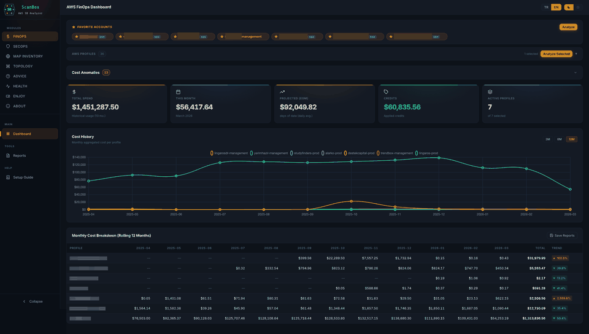

<p align="center">
  <a href="https://aws-scanbox-web.vercel.app/">
    
  </a>
</p>

<h1 align="center">ScanBox — AWS FinSecOps Analyzer</h1>

<p align="center">
  <strong>All-in-one AWS Financial Operations, Security Operations & Infrastructure Intelligence platform.</strong><br/>
  Single-command launch. No build step, no bundler, no cloud deployment required.
</p>

<p align="center">
  <a href="https://aws-scanbox-web.vercel.app/">Website</a> &bull;
  <a href="#installation">Installation</a> &bull;
  <a href="#modules">Modules</a> &bull;
  <a href="#contributing">Contributing</a> &bull;
  <a href="#changelog">Changelog</a> &bull;
  <a href="#license">License</a>
</p>

<p align="center">
  <a href="https://aws-scanbox-web.vercel.app/"></a>
  <br/>
  
  
  
  
  
</p>

---

## Table of Contents

- [Features Overview](#features-overview)
- [Prerequisites](#prerequisites)
- [Installation](#installation)
  - [macOS / Linux](#macos--linux)
  - [Windows](#windows)
  - [Manual Setup](#manual-setup)
  - [Demo Mode](#demo-mode)
- [Modules](#modules)
  - [FinOps — Financial Operations](#1--finops--financial-operations)
  - [SecOps — Security Operations](#2--secops--security-operations)
  - [MapInventory — Resource Inventory](#3--mapinventory--resource-inventory)
  - [Topology — Network Topology](#4--topology--network-topology)
  - [Advice — Well-Architected Review](#5--advice--well-architected-review)
  - [Health — Infrastructure Monitoring](#6--health--infrastructure-monitoring)
  - [About — Application Info](#7--about--application-info)
- [Tech Stack](#tech-stack)
- [Project Structure](#project-structure)
- [Configuration](#configuration)
- [Contributing](#contributing)
- [Changelog](#changelog)
- [License](#license)

---

## Features Overview

| Capability | Description |
|---|---|
| **Multi-Account Support** | Analyze any number of AWS profiles from `~/.aws/config` (including SSO) |
| **FinOps Cost Intelligence** | Monthly costs, service breakdown, region distribution, EC2 inventory, budget tracking |
| **Security Posture Assessment** | 24 AWS services scanned against CIS, HIPAA, ISO 27001, AWS WAFR frameworks |
| **Resource Inventory** | 150+ service collectors discover every resource across all opted-in regions |
| **Network Topology** | VPC architecture visualization — subnets, peering, transit gateways, security groups |
| **Well-Architected Advice** | 6-pillar WAFR assessment combining security findings, inventory, and cost data |
| **Health Monitoring** | Real-time latency to 27 AWS regions, DNS health, AWS/Cloudflare outage tracking |
| **Report Export** | Every module generates HTML, CSV, and PDF reports with one click |
| **Dark / Light Theme** | OS-aware theming with manual toggle, persisted in localStorage |
| **Bilingual UI** | Full Turkish / English interface with one-click language switching |

---

## Prerequisites

- **Python 3.8+** — [python.org/downloads](https://www.python.org/downloads/)
- **AWS CLI configured** — At least one profile in `~/.aws/config` with valid credentials or SSO
- **Cost Explorer enabled** — Required for FinOps, SecOps smart scan, MapInventory smart scan, and Advice modules

> **No Node.js, no Docker, no cloud account required to run the app itself.** Chart.js is loaded from CDN.

---

## Installation

### macOS / Linux

```bash
git clone https://github.com/serdarbayram01/aws-ScanBox-Analyzer.git
cd aws-ScanBox-Analyzer
chmod +x run.sh
./run.sh
```

The script automatically:
1. Detects `python3` (falls back to `python`)
2. Creates a `.venv` virtual environment if missing
3. Installs dependencies from `requirements.txt`
4. Starts Flask on **http://localhost:5100** and opens the browser

**Stop the server:** `Ctrl+C`

**Kill a stale server process:**
```bash
lsof -ti :5100 | xargs kill -9
```

### Windows

```cmd
git clone https://github.com/serdarbayram01/aws-ScanBox-Analyzer.git
cd aws-ScanBox-Analyzer
run.bat
```

The batch script performs the same steps: checks Python, creates `.venv`, installs dependencies, and starts the server at **http://localhost:5100**.

> **Note:** If `python` is not in your PATH on Windows, install Python from [python.org](https://www.python.org/downloads/) and check **"Add Python to PATH"** during installation.

### Manual Setup

If you prefer to set things up yourself:

```bash
# Create and activate virtual environment
python3 -m venv .venv
source .venv/bin/activate        # macOS/Linux
# .venv\Scripts\activate.bat     # Windows

# Install dependencies
pip install -r requirements.txt

# Start the server
python app.py
```

The app is available at **http://localhost:5100**.

### Demo Mode

To run without real AWS credentials (masks profile names and account IDs):

```bash
# macOS/Linux
SCANBOX_DEMO=1 python app.py

# Windows (PowerShell)
$env:SCANBOX_DEMO="1"; python app.py

# Windows (CMD)
set SCANBOX_DEMO=1 && python app.py
```

---

## Modules

### 1 — FinOps (Financial Operations)

> **Multi-account AWS cost analysis with service-level breakdown, region distribution, and EC2 inventory.**

| | |
|---|---|
| **AWS Services Used** | Cost Explorer, EC2, STS, Budgets |
| **Technology** | boto3 Cost Explorer API (always via `us-east-1`), 5-thread parallel detail fetching, 5-minute API cache |
| **Report Formats** | HTML, CSV, PDF |

#### Data & Insights

- **Cost Dashboard** — Select multiple AWS profiles, choose time range (1–12 months), view aggregated costs with month-over-month comparison
- **Service Breakdown** — Per-service cost table with daily granularity, sortable bar/donut charts
- **Region Distribution** — Separates actual regional infrastructure costs from global services (Route 53, Support, Marketplace, MongoDB Atlas, etc.) using smart keyword detection
- **EC2 Inventory** — Running/stopped instances with vCPU, RAM (GB), EBS disk count & total storage, fully sortable table with audit summary cards
- **Budget Tracking** — Actual vs. budgeted spend with percentage utilization
- **Credits & Discounts** — Detects negative amounts (RECORD_TYPE = Credit) and displays separately
- **Cost Trend** — Daily cost line chart for the selected period

#### Reports

Generates `aws_finops_{profile}_{timestamp}.{html|csv|pdf}` with:
- HTML: Styled tables, embedded Chart.js charts, service × month matrix
- CSV: Service × period cross-tab for spreadsheet analysis
- PDF: ReportLab-rendered summary with tables and cost graphs

---

### 2 — SecOps (Security Operations)

> **Comprehensive security posture assessment scanning 24 AWS services against 4 compliance frameworks.**

| | |
|---|---|
| **AWS Services Scanned** | IAM, S3, EC2, VPC, CloudTrail, GuardDuty, Config, CloudWatch, KMS, RDS, Lambda, ECS, EKS, ELB, DynamoDB, SQS, SNS, ECR, EFS, CloudFront, WAF, Route 53, ACM, Secrets Manager |
| **Compliance Frameworks** | CIS AWS Foundations, HIPAA, ISO 27001, AWS Well-Architected Framework (WAFR) |
| **Technology** | ThreadPoolExecutor for parallel scanning, Cost Explorer smart service detection, per-profile scan locking with 1-hour auto-release |
| **Report Formats** | HTML, CSV, PDF |

#### Smart Scan Pipeline

1. **Service Detection** — Queries Cost Explorer to determine which services are actively used. Core security services (IAM, S3, EC2, VPC, CloudTrail, GuardDuty, Config, CloudWatch, KMS) always scan. Optional services only scan if active — unused services don't inflate scores.
2. **Parallel Scanning** — Each service module runs concurrently via ThreadPoolExecutor with timeout handling.
3. **Finding Generation** — Each check produces a structured finding with severity, status, framework mappings, and remediation steps.
4. **Risk Scoring** — Three scores calculated:
   - *Base Score:* `PASS / (PASS + FAIL + WARNING×0.5)`
   - *Weighted Score:* Severity-weighted (CRITICAL=10×, HIGH=7×, MEDIUM=4×, LOW=2×, INFO=1×)
   - *Coverage Score:* `checked_services / (checked + manual_services)`
5. **Auto-Report** — HTML/CSV/PDF generated automatically after each scan.

#### Dashboard Visualizations

- **Radar Chart** — Per-service security score (expandable to fullscreen)
- **Pass Rate by Service** — Horizontal bar chart showing pass/fail ratio per service
- **Service Distribution** — Donut/bar toggle showing finding distribution
- **Framework Compliance** — CIS, HIPAA, ISO 27001 compliance gauges
- **WAFR Pillar Scores** — Per-pillar compliance (Security, Reliability, etc.)
- **Remediation Progress** — Stacked progress bars per severity
- **Score Trend** — Historical score tracking across scans (localStorage, max 20 data points)
- **Severity Heatmap** — Region × service heat map
- **Risk Treemap** — HTML-based risk exposure visualization
- **Top Failed Controls** — Ranked list of most-failed security controls

#### Finding Schema

Every finding includes: `id`, `title` (EN+TR), `description` (EN+TR), `severity` (CRITICAL/HIGH/MEDIUM/LOW/INFO), `status` (PASS/FAIL/WARNING/NOT_AVAILABLE/MANUAL), `service`, `resource_id`, `region`, `frameworks` (CIS, HIPAA, ISO 27001, WAFR mappings), and `remediation` steps (EN+TR).

---

### 3 — MapInventory (Resource Inventory)

> **Discover and catalog every AWS resource across 150+ services with smart scanning.**

| | |
|---|---|
| **AWS Services** | 150+ services — EC2, S3, Lambda, RDS, DynamoDB, ECS, EKS, VPC, API Gateway, CloudFront, Route 53, KMS, Secrets Manager, ElastiCache, Redshift, Glue, Athena, EMR, SageMaker, Bedrock, FSx, Backup, Organizations, and many more |
| **Technology** | Lock-free concurrency via `queue.Queue`, `Semaphore(5)` for concurrent profile scans, 10-minute global scan timeout, Cost Explorer smart scan |
| **Report Formats** | HTML, CSV, PDF |

#### Data & Insights

- **Resource Discovery** — Each collector calls the relevant boto3 `describe_*` / `list_*` APIs to enumerate resources
- **Resource Metadata** — Name, type, region, ARN, tags, service-specific configuration details
- **Aggregations** — Resource counts per service, per region, per resource type (built in a single O(N) pass)
- **Service Detail** — Drill into any service to see individual resources with full metadata
- **Smart Scanning** — Queries Cost Explorer for active services; core services always scan, unused services skipped automatically

#### Performance

- **Lock-Free Collection** — Results collected via `queue.Queue` (no lock contention)
- **Global Timeout** — 600s (10 min) via `concurrent.futures.as_completed(timeout=)`. Remaining tasks cancelled on timeout
- **Per-Task Timeout** — 30s per individual boto3 call
- **Scan History** — Max 20 cached scans per profile, oldest auto-deleted on new scan

---

### 4 — Topology (Network Topology)

> **Visualize your VPC network architecture across all regions with configurable detail levels.**

| | |
|---|---|
| **AWS Services** | VPC, Subnet, IGW, NAT Gateway, Route Table, VPC Peering, Security Group, NACL, VPC Endpoint, EIP, EC2, ECS, RDS, ELB, Lambda, EKS, API Gateway, Network Firewall, Transit Gateway, Direct Connect, VPN, CloudFront, S3, Route 53, Organizations |
| **Technology** | ThreadPoolExecutor for parallel regional collection, 3 view levels (Basic/Medium/Detailed), per-profile scan locking |
| **Report Formats** | HTML, CSV, PDF |

#### View Levels

| Level | Resources Collected |
|---|---|
| **Basic** | VPC, Subnet, Internet Gateway, NAT Gateway, Route Table, VPC Peering |
| **Medium** | + Security Group, NACL, VPC Endpoint, Elastic IP |
| **Detailed** | + EC2, ECS, RDS, ELB, Lambda, EKS, API Gateway, Network Firewall, Transit Gateway, Direct Connect, VPN, CloudFront, S3, Route 53, Organizations |

#### Data & Insights

- **VPC Architecture** — Full subnet layout with CIDR blocks, availability zones, and route tables
- **Security Boundaries** — Security groups and NACLs mapped to resources
- **Connectivity** — Inter-VPC peering, transit gateways, VPN connections, Direct Connect
- **Internet Access** — Internet gateways, NAT gateways, elastic IPs
- **Service Placement** — EC2, RDS, ECS, Lambda instances mapped to their VPCs and subnets

---

### 5 — Advice (Well-Architected Review)

> **Consolidated WAFR assessment combining SecOps, MapInventory, and FinOps data into actionable recommendations.**

| | |
|---|---|
| **Data Sources** | SecOps scan cache + MapInventory scan cache + live Cost Explorer data |
| **Frameworks** | AWS Well-Architected Framework — 6 Pillars |
| **Technology** | Multi-source data fusion, `wafr_knowledge.py` rule engine, background threading with progress polling |
| **Report Formats** | HTML, PDF (English + Turkish) |

#### Prerequisites

Advice requires **existing SecOps and MapInventory scan results** for the target profile. The module checks prerequisites before starting and prompts if scans are missing.

#### 6-Pillar Assessment

| Pillar | Assessment Areas |
|---|---|
| **Security** | Identity & access management, data protection, network security, threat detection |
| **Operational Excellence** | Organization, preparation, monitoring, incident response |
| **Reliability** | Availability, resilience, disaster recovery, change management |
| **Performance Efficiency** | Resource selection, review, optimization, architecture patterns |
| **Cost Optimization** | Financial management, expenditure control, resource right-sizing |
| **Sustainability** | Hardware efficiency, software architecture, data center optimization |

#### Data & Insights

- **Control Compliance** — Each WAFR control scored based on combined SecOps findings and resource inventory
- **Severity-Weighted Risk** — Prioritizes critical issues across all pillars
- **Service-Specific Advice** — Actionable remediation from `SERVICE_ADVICE_RULES` knowledge base
- **Cost Optimization** — Recommendations based on live Cost Explorer spend data
- **Resource-Level Guidance** — Specific advice based on resource counts and types discovered by MapInventory

---

### 6 — Health (Infrastructure Monitoring)

> **Real-time AWS region latency, DNS health, and outage monitoring with 4 background daemon threads.**

| | |
|---|---|
| **Data Sources** | TCP handshake to 27 AWS regions, DNS queries to Cloudflare/Google resolvers, AWS public status page, Cloudflare status API |
| **Technology** | 4 daemon threads (lazy-started on first visit), ThreadPoolExecutor(15) for parallel latency checks, exponential backoff, `deque`-based history |
| **Report Formats** | Dashboard only (real-time) |

#### Monitoring Threads

| Thread | Interval | What It Measures |
|---|---|---|
| **Region Latency** | 30s | TCP handshake time to 27 AWS regions (us-east-1, eu-west-1, ap-northeast-1, etc.) |
| **DNS Health** | 30s | Raw DNS queries to Cloudflare (1.1.1.1, 1.0.0.1) and Google (8.8.8.8, 8.8.4.4) resolvers |
| **AWS Outages** | 5 min | AWS public status page JSON (`status.aws.amazon.com`) with RSS fallback |
| **Cloudflare Status** | 5 min | Cloudflare public status API (`cloudflarestatus.com`) |

#### Data & Insights

- **Region Latency Map** — All 27 AWS regions ranked by TCP handshake latency with best-region recommendation
- **Latency History** — Trend chart (up to 120 data points = 1 hour at 30s intervals)
- **DNS Resolution** — Success/failure status for each resolver with response time
- **Active Outages** — Current AWS service incidents pulled from official status page
- **Cloudflare Status** — Component-level health of Cloudflare infrastructure
- **Smart Polling** — Frontend polls every 30s (matched to backend), pauses when browser tab is hidden

---

### 7 — About (Application Info)

> **Application metadata, version information, and module overview.**

Displays project description, tech stack summary, and module capabilities. Single static page.

---

## Tech Stack

| Layer | Technology |
|---|---|
| **Backend** | Python 3.8+, Flask 2.3+ |
| **AWS SDK** | boto3 1.28+ |
| **Data Processing** | pandas 2.0+ |
| **PDF Generation** | ReportLab 4.0+ |
| **Frontend** | Vanilla JavaScript (no framework), Chart.js 4.4 (CDN) |
| **Styling** | CSS3 custom properties (dark/light theming), responsive breakpoints |
| **Concurrency** | `ThreadPoolExecutor`, `threading.Lock`, `Semaphore`, `queue.Queue` |
| **i18n** | Custom TR/EN translation system (`i18n.js`) |

---

## Project Structure

```
aws-ScanBox-Analyzer/
├── app.py                    # Flask entry point — registers 8 blueprints
├── aws_client.py             # Shared boto3 client (CE, EC2, STS, Budgets)
├── report_generator.py       # FinOps report export (HTML/CSV/PDF)
├── requirements.txt          # Python dependencies
├── run.sh                    # macOS/Linux launcher
├── run.bat                   # Windows launcher
├── modules/
│   ├── finops/               # Cost analysis & reporting
│   ├── secops/               # Security scanning (24 service modules)
│   │   ├── scanner.py        #   Scan orchestrator
│   │   └── inventory/        #   24 service check modules
│   ├── mapinventory/         # Resource inventory (150+ collectors)
│   │   └── collectors/       #   One file per AWS service
│   ├── topology/             # Network topology visualization
│   ├── advice/               # WAFR assessment engine
│   │   └── wafr_knowledge.py #   Framework definitions & rules
│   ├── health/               # Real-time monitoring (4 daemon threads)
│   │   └── monitor.py        #   Background monitoring threads
│   ├── enjoy/                # Mini games
│   └── about/                # App info page
├── templates/                # Jinja2 HTML templates
│   └── base.html             # Shared sidebar layout
├── static/
│   ├── css/theme.css         # All CSS (dark/light theme variables)
│   └── js/
│       ├── i18n.js           # Translations, icons, chart helpers
│       ├── dashboard.js      # FinOps dashboard
│       └── detail.js         # FinOps detail page
├── img/                      # Screenshots
├── reports/                  # Generated reports (gitignored)
└── logs/                     # Request & audit logs (gitignored)
```

---

## Configuration

### AWS Profiles

ScanBox reads profiles from `~/.aws/config`. Both static credentials and SSO profiles are supported. If an SSO session expires, ScanBox shows a red banner with a copyable login command:

```
aws sso login --profile <profile-name>
```

### Environment Variables

| Variable | Default | Description |
|---|---|---|
| `SCANBOX_DEMO` | *(unset)* | Set to `1` to mask real profile names and account IDs |

### Key Constraints

- **Cost Explorer** queries always go through `us-east-1` (AWS requirement)
- Cost Explorer history is capped at **12 months / 365 days**
- AWS Credits appear as negative amounts; grant details (expiry, remaining balance) are **not available via any boto3 API**
- API results are cached with a **5-minute TTL** to minimize API calls
- Rate limiting: **60 requests/minute per IP** on API endpoints

---

## Contributing

Contributions are welcome! Whether it's a new AWS service collector, a bug fix, or a UI improvement — all contributions help make ScanBox better.

Please read the **[Contributing Guide](CONTRIBUTING.md)** before submitting a pull request. It covers:

- Development setup and architecture overview
- How to add new SecOps inventory modules (24 → ?)
- How to add new MapInventory collectors (150+ → ?)
- Code style, commit conventions, and PR process

### Quick Start for Contributors

```bash
# Fork & clone
git clone https://github.com/serdarbayram01/aws-ScanBox-Analyzer.git
cd aws-ScanBox-Analyzer

# Set up dev environment
python3 -m venv .venv
source .venv/bin/activate
pip install -r requirements.txt

# Run in demo mode (no AWS credentials needed)
SCANBOX_DEMO=1 python app.py
```

---

## Changelog

See **[CHANGELOG.md](CHANGELOG.md)** for a detailed version history and **[VERSIONING.md](VERSIONING.md)** for the versioning strategy.

### Latest: v1.0.0 (March 2026)

- 7 core modules: FinOps, SecOps, MapInventory, Topology, Advice, Health, About
- 24 SecOps security check modules across 4 compliance frameworks
- 150+ MapInventory resource collectors
- HTML/CSV/PDF report generation for all modules
- Dark/light theme with OS preference detection
- Bilingual UI (Turkish / English)
- Demo mode for safe showcasing

### Version Numbering

| Bump | When | Example |
|---|---|---|
| **PATCH** (1.0.x) | Bug fix, new collector/check, CSS fix | Fix radar chart rendering |
| **MINOR** (1.x.0) | New user-facing feature, new SecOps service module, new chart | Add Redshift scanning |
| **MAJOR** (x.0.0) | New sidebar module, breaking API/config change | Add Compliance Center module |

---

## License

This project is licensed under the **MIT License** — see the [LICENSE](LICENSE) file for details.

Copyright (c) 2026 ScanBox - AWS FinSecOps Analyzer
